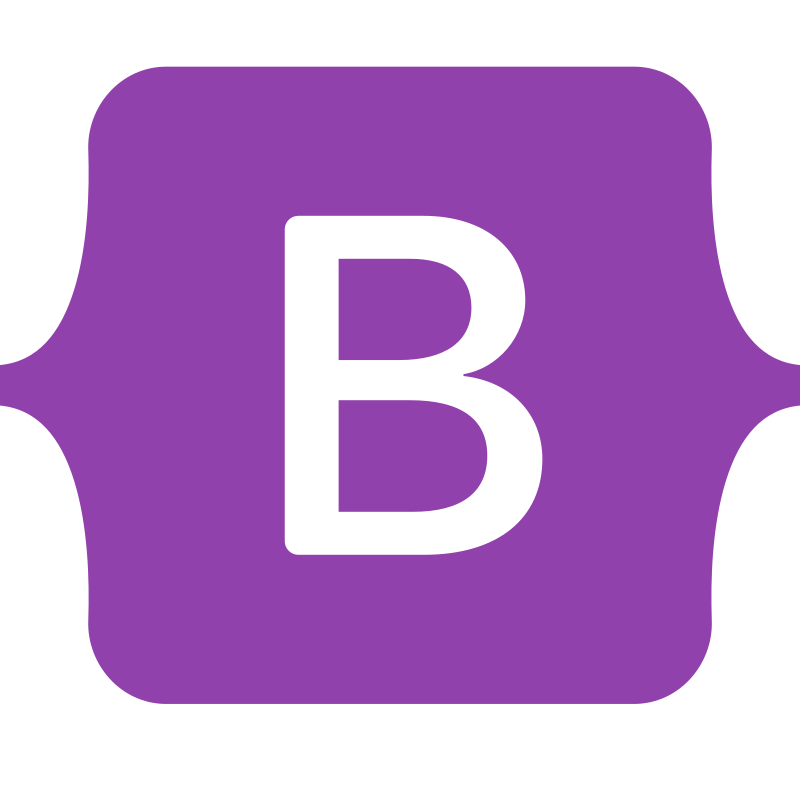
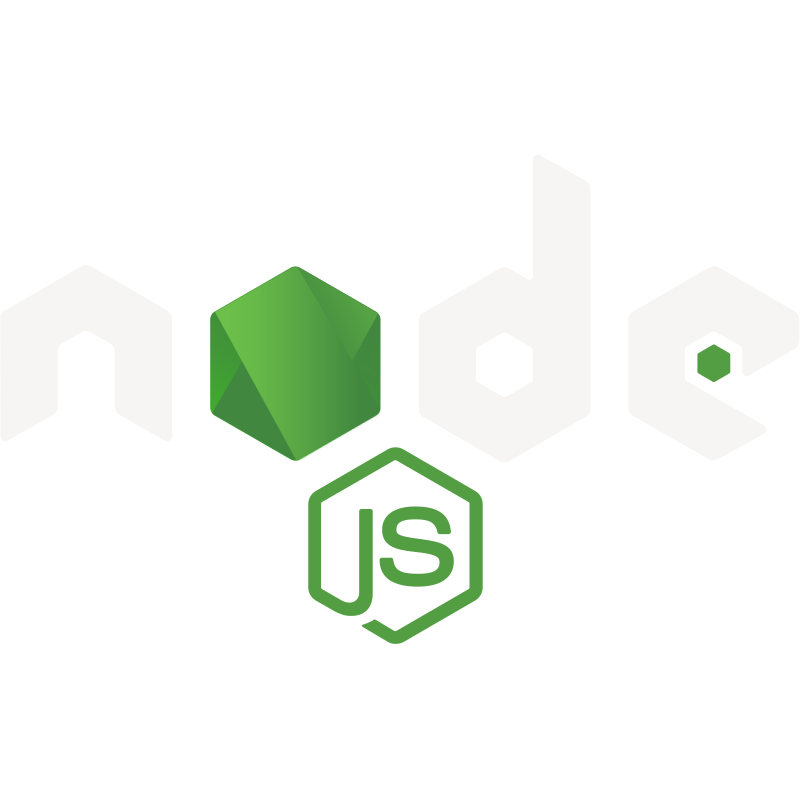

# Hi 👋, I'm Manimehalan

### A passionate fullstack developer from Sri Lanka

   

- 💬 Ask me about **React, Laravel, and Inertia.js**

---

### 🖥️ Languages and Tools

Here are some of the languages and tools I work with:

###### Languages

  
  &nbsp;
  
  &nbsp;
  
  &nbsp;
  
  &nbsp;
  
  &nbsp;
  
  &nbsp;
  
  &nbsp;
  
  &nbsp;
  
  &nbsp;
  
  &nbsp;
  

###### Frameworks, Utilities & Libraries (frontend and backend)

  
  &nbsp;
  
  &nbsp;
  
  &nbsp;
  
  &nbsp;
  
  &nbsp;
  
  &nbsp;
  
  &nbsp;
  
  &nbsp;
  
  &nbsp;
  
  &nbsp;
  

###### Payment Processing

  
  &nbsp;
  

###### Databases & Caching

  
  &nbsp;
  
  &nbsp;
  
  &nbsp;
  

###### Testing

  
  &nbsp;
  
  &nbsp;

###### Devops & Cloud

  
  &nbsp;
  

###### Webservers

  
  &nbsp;
  

###### Tools & Softwares

  
  &nbsp;
  
  &nbsp;
  
  &nbsp;
  
  &nbsp;
  
  &nbsp;
  

---

### 📊 GitHub Stats

<table>
  <tr>
    <td>
      
    </td>
    <td>
      
    </td>
  </tr>
  <!-- <tr>
    <td colspan="2">
      
    </td>
  </tr> -->
</table>

  

---

### 🏆 Github Trophies

  

---

### 🤝 Support

  

  

---

### 📧 Connect with Me

  
  

